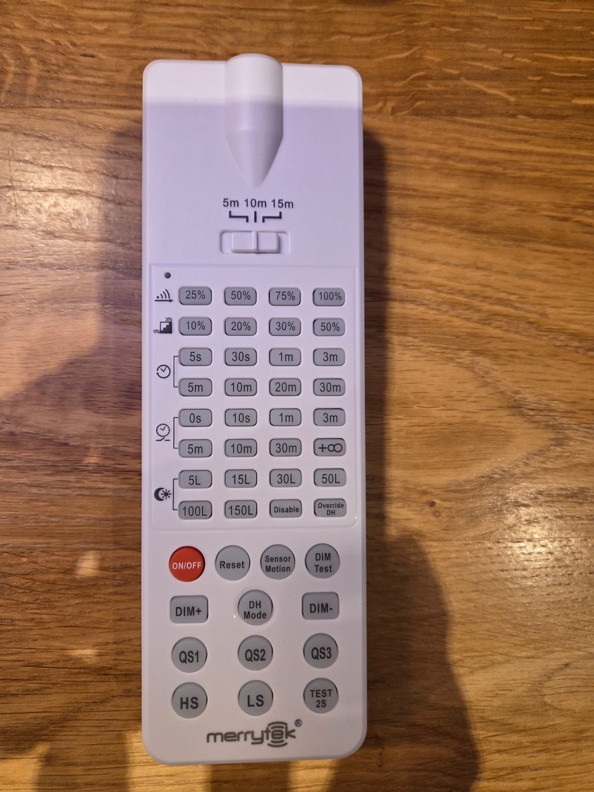

# Merrytek IR Remote Control - ESPHome Integration

This repository contains the full infrared command set for Merrytek Lighting Sensors, decoded and verified using an ESP32. It allows for the complete digitalization and automation of Merrytek sensors within Home Assistant.

## Hardware Setup
- **Microcontroller:** ESP32 (e.g., DevKit V1)
- **IR Receiver:** TSOP38238 or similar (38kHz)
- **IR Transmitter:** 940nm IR LED (driven via NPN transistor/2N2222 for maximum range)
- **Protocol:** NEC
- **Address:** `0x5372`

## Remote Layout

*Note: This documentation covers the 8-row configuration including Brightness, Hold Time, Standby Period, and Daylight Sensor settings.*

---

## 1. Master & Function Commands
These commands control the operational modes of the sensor.

| Button | NEC Command | Full Pronto Hex Code |
| :--- | :--- | :--- |
| **ON/OFF** | `0xFE01` | `0000 006D 0022 0000 015C 00AB 0018 0013 0018 003F 0017 0014 0018 0014 0018 0040 0017 003F 0017 003F 0017 0013 0018 0040 0017 0040 0017 0013 0018 0014 0018 003F 0017 0014 0018 0040 0017 0013 0018 003F 0017 0013 0018 0013 0018 0014 0018 0014 0018 0013 0018 0014 0018 0014 0018 0014 0018 0040 0017 003F 0017 0040 0017 003F 0017 003F 0016 0040 0017 003F 0017 0181` |
| **Reset** | `0xFD02` | `0000 006D 0022 0000 015C 00AB 0017 0015 0016 0040 0016 0015 0016 0015 0016 0040 0016 0040 0016 0040 0016 0015 0016 0040 0016 0040 0016 0015 0016 0015 0016 0040 0016 0015 0016 0040 0016 0015 0016 0015 0016 0040 0016 0015 0016 0015 0016 0015 0016 0015 0016 0015 0016 0015 0016 0040 0016 0015 0016 0040 0016 0040 0016 0040 0017 003F 0018 003F 0018 003F 0019 0181` |
| **Sensor Motion** | `0xFC03` | `0000 006D 0022 0000 015C 00AB 0017 0015 0016 0040 0016 0015 0016 0015 0016 0040 0016 0040 0016 0040 0016 0015 0016 0040 0016 0040 0016 0015 0016 0015 0016 0040 0016 0015 0016 0040 0016 0015 0016 0040 0016 0040 0016 0015 0016 0015 0016 0015 0016 0015 0016 0015 0016 0015 0016 0015 0016 0015 0016 0040 0016 0040 0016 0040 0016 0040 0016 0040 0016 0040 0017 0181` |
| **Dim Test** | `0xFB04` | `0000 006D 0022 0000 015C 00AB 0018 0015 0016 0040 0016 0015 0016 0015 0016 0040 0016 0040 0016 0040 0016 0015 0016 0040 0016 0040 0017 0015 0016 0015 0016 0040 0016 0015 0016 0040 0016 0015 0016 0015 0016 0015 0016 0040 0016 0015 0016 0015 0016 0015 0016 0015 0016 0015 0016 0040 0017 0040 0016 0015 0016 0040 0017 0040 0017 0040 0017 0040 0017 0040 0017 0181` |
| **Test 2S** | `0x6B94` | `0000 006D 0022 0000 015D 00AA 0017 0015 0016 0040 0016 0015 0016 0015 0016 0040 0016 0040 0016 0040 0016 0015 0017 003F 0016 0040 0016 0015 0016 0015 0016 0040 0017 0014 0016 0040 0017 0014 0017 0014 0017 0014 0016 0040 0016 0015 0017 003F 0017 0014 0017 0014 0017 003F 0017 003F 0018 003E 0017 0014 0017 003F 0017 0014 0017 003F 0017 003F 0019 0012 001A 0181` |
| **QS1 (Scene)** | `0xEC13` | `0000 006D 0022 0000 015C 00AB 0017 0015 0016 0040 0017 0013 0017 0015 0016 0040 0016 0040 0016 0040 0016 0015 0016 0040 0017 003F 0016 0015 0016 0014 0017 0040 0016 0015 0016 0040 0016 0014 0018 003F 0017 003F 0017 0014 0017 0013 0018 003F 0017 0014 0017 0014 0017 0014 0017 0014 0017 0014 0017 003F 0017 003F 0017 0014 0017 003F 0016 0040 0017 003F 0017 0181` |
| **QS2 (Scene)** | `0xEB14` | `0000 006D 0022 0000 015C 00AB 0017 0015 0016 0040 0016 0015 0016 0015 0016 0040 0016 0040 0016 0040 0016 0015 0016 0040 0016 0040 0016 0015 0016 0015 0016 0040 0016 0015 0016 0040 0016 0015 0016 0015 0016 0015 0016 0040 0016 0015 0016 0040 0016 0015 0016 0014 0017 0015 0016 0040 0016 0040 0016 0015 0016 0040 0016 0015 0016 0040 0016 0040 0016 0040 0016 0181` |
| **QS3 (Scene)** | `0x4EB1` | `0000 006D 0022 0000 015C 00AB 0017 0015 0016 0040 0016 0014 0017 0015 0016 0040 0016 0040 0016 0040 0016 0015 0016 0040 0016 0040 0016 0015 0016 0015 0016 0040 0016 0015 0016 0040 0016 0015 0016 0040 0016 0015 0016 0015 0016 0015 0016 0040 0016 0040 0016 0015 0016 0040 0016 0015 0016 0040 0016 0040 0016 0040 0016 0015 0016 0015 0016 0040 0016 0015 0016 0181` |

---

## 2. Sensitivity & Dimming
Manual adjustment commands.

| Button | NEC Command | Full Pronto Hex Code |
| :--- | :--- | :--- |
| **DIM +** | `0x5EA1` | `0000 006D 0022 0000 015C 00AB 0017 0015 0016 0040 0016 0015 0016 0015 0016 0040 0016 0040 0016 0040 0016 0015 0016 0040 0016 0040 0016 0015 0016 0015 0016 0040 0016 0015 0016 0040 0016 0015 0016 0040 0016 0015 0016 0015 0016 0015 0016 0015 0016 0040 0016 0015 0016 0040 0016 0015 0016 0040 0016 0040 0016 0040 0016 0040 0016 0015 0016 0040 0016 0015 0016 0181` |
| **DIM -** | `0x5CA3` | `0000 006D 0022 0000 015C 00AB 0017 0014 0017 0040 0016 0015 0016 0014 0017 0040 0016 0040 0016 0040 0016 0015 0016 0040 0016 0040 0016 0014 0017 0015 0016 0040 0016 0015 0016 0040 0016 0015 0016 0040 0016 0040 0016 0015 0016 0014 0017 0015 0016 0040 0016 0015 0016 0040 0016 0015 0016 0015 0016 0040 0016 0040 0016 0040 0016 0015 0016 0040 0016 0015 0016 0181` |
| **HS (High Sens)** | `0xEE11` | `0000 006D 0022 0000 015C 00AB 0017 0015 0016 0040 0016 0015 0016 0015 0016 0040 0016 0040 0016 0040 0016 0014 0017 0040 0016 0040 0016 0015 0016 0015 0016 0040 0016 0015 0016 0040 0016 0015 0016 0040 0016 0015 0016 0015 0016 0015 0016 0040 0016 0015 0016 0015 0016 0015 0016 0015 0016 0040 0016 0040 0016 0040 0016 0015 0016 0040 0016 0040 0016 0040 0016 0181` |
| **LS (Low Sens)** | `0xED12` | `0000 006D 0022 0000 015C 00AB 0017 0014 0017 0040 0016 0015 0016 0014 0017 0040 0016 0040 0016 0040 0016 0014 0017 0040 0016 0040 0016 0015 0016 0015 0016 0040 0016 0015 0016 0040 0016 0014 0017 0015 0016 0040 0016 0015 0016 0015 0016 0040 0016 0015 0016 0014 0017 0014 0017 0040 0016 0015 0016 0040 0016 0040 0016 0015 0016 0040 0016 0040 0016 0040 0016 0181` |

---

### 3. Brightness Settings (%)
Configuration for the primary light output level.

| Level | NEC Command | Full Pronto Hex Code |
| :--- | :--- | :--- |
| **10%** | `0xAE51` | `0000 006D 0022 0000 015C 00AB 0017 0015 0016 0040 0016 0015 0016 0015 0016 0040 0016 0040 0016 0040 0016 0015 0016 0040 0016 0040 0016 0015 0016 0015 0016 0040 0016 0015 0016 0040 0016 0015 0016 0040 0016 0015 0016 0015 0016 0015 0016 0040 0016 0015 0016 0040 0016 0015 0016 0015 0016 0040 0016 0040 0016 0040 0016 0015 0016 0040 0016 0015 0016 0040 0016 0181` |
| **20%** | `0xAD52` | `0000 006D 0022 0000 015C 00AB 0017 0015 0016 0040 0016 0015 0016 0015 0016 0040 0016 0040 0016 0040 0016 0015 0016 0040 0016 0040 0016 0015 0016 0015 0016 0040 0016 0015 0016 0040 0016 0015 0016 0015 0016 0040 0016 0015 0016 0015 0016 0040 0016 0015 0016 0040 0016 0015 0016 0040 0016 0015 0016 0040 0016 0040 0016 0015 0016 0040 0016 0015 0016 0040 0016 0181` |
| **25%** | `0xDE21` | `0000 006D 0022 0000 015C 00AB 0018 0015 0016 0040 0017 0014 0017 0014 0016 0040 0018 003F 0017 003F 0018 0013 0018 003F 0016 0040 0016 0014 0018 0014 0017 003F 0016 0015 0016 0040 0016 0015 0017 003F 0016 0015 0016 0015 0016 0015 0018 0013 0018 003E 0017 0013 0018 0014 0019 0013 0017 003F 0017 003F 0017 003F 0017 003F 0017 0014 0017 003F 0017 003F 0019 0181` |
| **30%** | `0xAC53` | `0000 006D 0022 0000 015C 00AB 0017 0015 0016 0040 0016 0015 0016 0015 0016 0040 0016 0040 0016 0040 0016 0015 0016 0040 0016 0040 0016 0015 0016 0015 0016 0040 0016 0015 0016 0040 0016 0015 0016 0040 0016 0040 0016 0015 0016 0015 0016 0040 0016 0015 0016 0040 0016 0015 0016 0015 0016 0015 0016 0040 0016 0040 0016 0015 0016 0040 0016 0015 0016 0040 0016 0181` |
| **50%** | `0xDD22` | `0000 006D 0022 0000 015C 00AB 0017 0015 0016 0040 0016 0015 0016 0015 0016 0040 0016 0040 0016 0040 0016 0015 0016 0040 0016 0040 0016 0015 0016 0015 0016 0040 0016 0015 0016 0040 0016 0015 0016 0015 0016 0040 0016 0015 0016 0015 0016 0015 0016 0040 0016 0015 0016 0015 0016 0040 0016 0015 0016 0040 0016 0040 0016 0040 0016 0015 0016 0040 0016 0040 0016 0181` |
| **75%** | `0xDC23` | `0000 006D 0022 0000 015C 00AB 0017 0015 0016 0040 0016 0015 0016 0015 0016 0040 0016 0040 0016 0040 0016 0015 0016 0040 0016 0040 0016 0015 0016 0015 0016 0040 0016 0015 0016 0040 0016 0015 0016 0040 0016 0040 0016 0015 0016 0015 0016 0015 0016 0040 0016 0015 0016 0015 0016 0015 0016 0015 0017 003F 0017 003F 0018 003F 0018 0014 0019 003E 001A 003C 001B 0181` |
| **100%** | `0xDB24` | `0000 006D 0022 0000 015C 00AB 0017 0015 0016 0040 0016 0015 0016 0015 0016 0040 0016 0040 0016 0040 0016 0015 0016 0040 0016 0040 0016 0015 0016 0015 0016 0040 0016 0015 0016 0040 0016 0015 0016 0015 0016 0015 0016 0040 0016 0015 0016 0015 0016 0040 0016 0015 0016 0015 0016 0040 0016 0040 0016 0015 0016 0040 0016 0040 0016 0015 0016 0040 0016 0040 0016 0181` |

---

### 4. Hold Time Settings
Determines how long the light stays on after the last motion detection.

| Time | NEC Command | Full Pronto Hex Code |
| :--- | :--- | :--- |
| **5s** | `0xCE31` | `0000 006D 0022 0000 015C 00AB 0017 0015 0016 0040 0016 0015 0016 0015 0016 0040 0016 0040 0016 0040 0016 0015 0016 0040 0016 0040 0016 0015 0016 0015 0016 0040 0016 0015 0016 0040 0016 0015 0016 0040 0016 0015 0016 0015 0016 0015 0016 0040 0016 0040 0016 0015 0016 0015 0016 0015 0016 0040 0016 0040 0016 0040 0016 0015 0016 0015 0016 0040 0016 0040 0016 0181` |
| **30s** | `0xCD32` | `0000 006D 0022 0000 015C 00AB 0017 0015 0016 0040 0016 0015 0016 0015 0016 0040 0016 0040 0016 0040 0016 0015 0016 0040 0016 0040 0016 0015 0016 0015 0016 0040 0016 0015 0016 0040 0016 0015 0016 0015 0016 0040 0016 0015 0016 0015 0016 0040 0016 0040 0016 0015 0016 0015 0016 0040 0016 0015 0016 0040 0016 0040 0016 0015 0016 0015 0016 0040 0016 0040 0016 0181` |
| **1min** | `0xCC33` | `0000 006D 0022 0000 015C 00AB 0017 0015 0016 0040 0016 0015 0016 0015 0016 0040 0016 0040 0016 0040 0016 0015 0016 0040 0016 0040 0016 0015 0016 0015 0016 0040 0016 0015 0016 0040 0016 0015 0016 0040 0016 0040 0016 0015 0016 0015 0016 0040 0016 0040 0016 0015 0016 0015 0016 0015 0016 0015 0016 0040 0016 0040 0017 0014 0016 0015 0016 0040 0017 003F 0017 0181` |
| **3min** | `0xCB34` | `0000 006D 0022 0000 015C 00AB 0017 0015 0016 0040 0016 0015 0016 0015 0016 0040 0016 0040 0016 0040 0016 0015 0016 0040 0016 0040 0016 0015 0016 0015 0016 0040 0016 0015 0016 0040 0016 0015 0016 0015 0016 0015 0016 0040 0016 0015 0016 0040 0016 0040 0016 0015 0016 0015 0016 0040 0016 0040 0016 0015 0016 0040 0016 0015 0016 0015 0016 0040 0016 0040 0016 0181` |
| **5min** | `0xBE41` | `0000 006D 0022 0000 015C 00AB 0017 0015 0016 0040 0016 0015 0016 0015 0016 0040 0016 0040 0016 0040 0016 0015 0016 0040 0016 0040 0016 0015 0016 0015 0016 0040 0016 0015 0016 0040 0016 0015 0016 0040 0016 0015 0016 0015 0016 0015 0016 0015 0016 0015 0016 0040 0016 0015 0016 0015 0016 0040 0016 0040 0016 0040 0016 0040 0017 003F 0017 0014 0018 003F 0018 0181` |
| **10min** | `0xBD42` | `0000 006D 0022 0000 015C 00AB 0017 0015 0016 0040 0016 0015 0016 0015 0016 0040 0016 0040 0016 0040 0016 0015 0016 0040 0016 0040 0016 0015 0016 0015 0016 0040 0016 0015 0016 0040 0016 0015 0016 0015 0016 0040 0016 0015 0016 0015 0016 0015 0016 0015 0016 0040 0016 0015 0016 0040 0016 0015 0016 0040 0016 0040 0016 0040 0016 0040 0016 0015 0016 0040 0016 0181` |
| **20min** | `0xBC43` | `0000 006D 0022 0000 015C 00AB 0017 0015 0016 0040 0016 0015 0016 0015 0016 0040 0016 0040 0016 0040 0016 0015 0016 0040 0016 0040 0016 0015 0016 0015 0016 0040 0016 0015 0016 0040 0016 0015 0016 0040 0016 0040 0016 0015 0016 0015 0016 0015 0016 0015 0016 0040 0016 0015 0016 0015 0016 0015 0016 0040 0016 0040 0016 0040 0016 0040 0016 0015 0016 0040 0016 0181` |
| **30min** | `0xBB44` | `0000 006D 0022 0000 015C 00AB 0017 0015 0016 0040 0016 0015 0016 0015 0016 0040 0016 0040 0016 0040 0016 0015 0016 0040 0016 0040 0016 0015 0016 0015 0016 0040 0016 0015 0016 0040 0016 0015 0016 0015 0016 0015 0016 0040 0016 0015 0016 0015 0016 0015 0016 0040 0016 0015 0016 0040 0016 0040 0016 0015 0016 0040 0016 0040 0016 0040 0016 0015 0016 0040 0016 0181` |

---

### 5. Standby Period Settings
Configuration for the dimmed period before the light turns off completely.

| Time | NEC Command | Full Pronto Hex Code |
| :--- | :--- | :--- |
| **0s** | `0x9E61` | `0000 006D 0022 0000 015C 00AB 0017 0015 0016 0040 0016 0015 0016 0015 0016 0040 0016 0040 0016 0040 0016 0015 0016 0040 0016 0040 0016 0015 0016 0015 0016 0040 0016 0015 0016 0040 0016 0015 0016 0040 0016 0015 0016 0015 0016 0015 0016 0015 0016 0040 0016 0040 0016 0015 0016 0015 0016 0040 0016 0040 0016 0040 0016 0040 0016 0015 0016 0015 0016 0040 0016 0181` |
| **10s** | `0x9D62` | `0000 006D 0022 0000 015C 00AB 0017 0015 0016 0040 0016 0015 0016 0015 0016 0040 0016 0040 0016 0040 0016 0015 0016 0040 0016 0040 0016 0015 0016 0015 0016 0040 0016 0015 0016 0040 0016 0015 0016 0015 0016 0040 0016 0015 0016 0015 0016 0015 0016 0040 0016 0040 0016 0015 0016 0040 0016 0015 0016 0040 0016 0040 0016 0040 0016 0015 0016 0015 0016 0040 0016 0181` |
| **1min** | `0x9C63` | `0000 006D 0022 0000 015C 00AB 0017 0015 0016 0040 0016 0015 0016 0015 0016 0040 0016 0040 0016 0040 0016 0015 0016 0040 0016 0040 0016 0015 0016 0015 0016 0040 0016 0015 0016 0040 0016 0015 0016 0040 0016 0040 0016 0015 0016 0015 0016 0015 0016 0040 0016 0040 0016 0015 0016 0015 0016 0015 0017 003F 0017 003F 0017 003F 0017 0014 0018 0012 001A 003E 001A 0181` |
| **3min** | `0x9B64` | `0000 006D 0022 0000 015C 00AB 0017 0015 0016 0040 0016 0015 0016 0015 0016 0040 0016 0040 0016 0040 0016 0015 0016 0040 0016 0040 0016 0015 0016 0015 0016 0040 0016 0015 0016 0040 0016 0015 0016 0015 0016 0015 0016 0040 0016 0015 0016 0015 0016 0040 0016 0040 0016 0015 0016 0040 0016 0040 0016 0015 0016 0040 0016 0040 0016 0015 0016 0015 0016 0040 0016 0181` |
| **5min** | `0x8E71` | `0000 006D 0022 0000 015C 00AB 0017 0015 0016 0040 0016 0015 0016 0015 0016 0040 0016 0040 0016 0040 0016 0015 0016 0040 0016 0040 0016 0015 0016 0015 0016 0040 0016 0015 0016 0040 0016 0015 0016 0040 0016 0015 0016 0015 0016 0015 0016 0040 0016 0040 0016 0040 0016 0015 0016 0015 0016 0040 0016 0040 0016 0040 0017 0014 0016 0015 0017 0014 0017 003F 0017 0181` |
| **10min** | `0x8D72` | `0000 006D 0022 0000 015C 00AB 0017 0015 0016 0040 0016 0015 0016 0015 0016 0040 0016 0040 0016 0040 0016 0015 0016 0040 0016 0040 0016 0015 0016 0015 0016 0040 0016 0015 0016 0040 0016 0015 0016 0015 0016 0040 0016 0015 0016 0015 0016 0040 0016 0040 0016 0040 0016 0015 0016 0040 0016 0015 0016 0040 0016 0040 0016 0015 0016 0015 0016 0015 0016 0040 0016 0181` |
| **30min** | `0x8C73` | `0000 006D 0022 0000 015C 00AB 0017 0015 0016 0040 0016 0015 0016 0015 0016 0040 0016 0040 0016 0040 0016 0015 0016 0040 0016 0040 0016 0015 0016 0015 0016 0040 0016 0015 0016 0040 0016 0015 0016 0040 0016 0040 0016 0015 0016 0015 0016 0040 0016 0040 0016 0040 0016 0015 0016 0015 0016 0015 0016 0040 0016 0040 0016 0015 0016 0015 0016 0015 0016 0040 0016 0181` |
| **+inf** | `0x8B74` | `0000 006D 0022 0000 015C 00AB 0017 0015 0016 0040 0016 0015 0016 0015 0016 0040 0016 0040 0016 0040 0016 0015 0016 0040 0017 003F 0016 0015 0016 0015 0016 0040 0016 0015 0016 0040 0016 0015 0016 0015 0016 0015 0016 0040 0016 0015 0016 0040 0016 0040 0016 0040 0016 0015 0016 0040 0016 0040 0016 0015 0016 0040 0016 0015 0016 0015 0016 0015 0016 0040 0016 0181` |

---

### 6. Daylight Sensor (Lux) Settings
Threshold configuration for light-dependent activation.

| Lux | NEC Command | Full Pronto Hex Code |
| :--- | :--- | :--- |
| **5L** | `0x7E81` | `0000 006D 0022 0000 015C 00AB 0017 0015 0016 0040 0016 0015 0016 0015 0016 0040 0016 0040 0016 0040 0016 0015 0016 0040 0016 0040 0016 0015 0016 0015 0016 0040 0016 0015 0016 0040 0016 0015 0016 0040 0016 0015 0016 0015 0016 0015 0016 0015 0016 0015 0016 0015 0016 0040 0016 0015 0016 0040 0016 0040 0016 0040 0016 0040 0016 0040 0016 0040 0016 0015 0016 0181` |
| **15L** | `0x7D82` | `0000 006D 0022 0000 015C 00AB 0017 0015 0016 0040 0016 0015 0016 0015 0016 0040 0016 0040 0016 0040 0016 0015 0016 0040 0016 0040 0016 0015 0016 0015 0016 0040 0016 0015 0016 0040 0016 0015 0016 0015 0016 0040 0016 0015 0016 0015 0016 0015 0016 0015 0016 0015 0016 0040 0016 0040 0016 0015 0016 0040 0016 0040 0016 0040 0016 0040 0016 0040 0017 0014 0016 0181` |
| **30L** | `0x7C83` | `0000 006D 0022 0000 015C 00AB 0017 0015 0016 0040 0016 0015 0016 0014 0017 0040 0016 0040 0016 0040 0016 0015 0016 0040 0016 0040 0016 0015 0016 0015 0016 0040 0016 0015 0016 0040 0016 0015 0016 0040 0016 0040 0016 0015 0016 0015 0016 0015 0016 0015 0016 0015 0016 0040 0016 0015 0016 0015 0016 0040 0016 0040 0016 0040 0016 0040 0016 0040 0016 0015 0016 0181` |
| **50L** | `0x7B84` | `0000 006D 0022 0000 015C 00AB 0017 0015 0016 0040 0016 0015 0016 0015 0016 0040 0016 0040 0016 0040 0016 0015 0016 0040 0016 0040 0016 0015 0016 0015 0016 0040 0016 0015 0016 0040 0016 0015 0016 0015 0016 0015 0016 0040 0016 0015 0016 0015 0016 0015 0016 0015 0016 0040 0016 0040 0016 0040 0016 0015 0016 0040 0016 0040 0016 0040 0016 0040 0016 0015 0016 0181` |
| **100L** | `0x6E91` | `0000 006D 0022 0000 015C 00AB 0017 0015 0016 0040 0016 0015 0016 0015 0016 0040 0016 0040 0016 0040 0016 0015 0016 0040 0016 0040 0016 0015 0016 0015 0016 0040 0016 0015 0016 0040 0016 0015 0016 0040 0016 0015 0016 0015 0016 0015 0016 0040 0016 0015 0016 0015 0016 0040 0016 0015 0016 0040 0016 0040 0016 0040 0016 0015 0016 0040 0016 0040 0016 0015 0016 0181` |
| **150L** | `0x6D92` | `0000 006D 0022 0000 015C 00AB 0017 0015 0016 0040 0017 0013 0017 0015 0016 0040 0016 0040 0016 0040 0016 0015 0016 0040 0016 0040 0016 0015 0016 0015 0016 0040 0016 0015 0016 0040 0016 0015 0016 0015 0016 0040 0016 0015 0016 0015 0016 0040 0016 0015 0016 0015 0016 0040 0016 0040 0016 0015 0016 0040 0016 0040 0017 0014 0016 0040 0016 0040 0016 0015 0016 0181` |
| **Disable** | `0x6C93` | `0000 006D 0022 0000 015C 00AB 0017 0015 0016 0040 0016 0015 0016 0015 0016 0040 0016 0040 0016 0040 0016 0014 0017 0040 0016 0040 0016 0015 0016 0014 0017 0040 0016 0015 0016 0040 0016 0015 0016 0040 0016 0040 0016 0015 0016 0015 0016 0040 0016 0015 0016 0015 0016 0040 0016 0015 0016 0015 0016 0040 0016 0040 0016 0015 0016 0040 0016 0040 0016 0015 0016 0181` |

---

## Example ESPHome Button
Add this to your configuration to trigger a command from the dashboard:

```yaml
button:
  - platform: template
    name: "Merrytek Reset"
    icon: "mdi:restart"
    on_press:
      - remote_transmitter.transmit_nec:
          address: 0x5372
          command: 0xFD02
