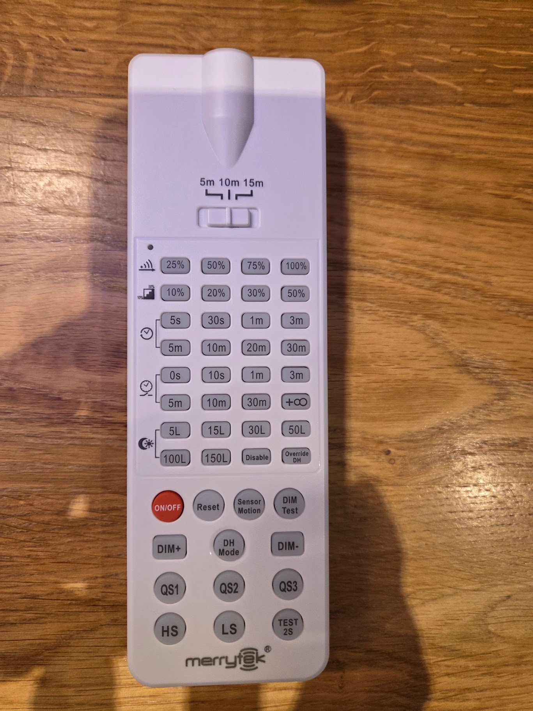

# Merrytek IR Remote Control - ESPHome Integration

This repository contains the full infrared command set for Merrytek Lighting Sensors, decoded and verified using an ESP32. It allows for the complete digitalization and automation of Merrytek sensors within Home Assistant.

## Hardware Setup
- **Microcontroller:** ESP32 (e.g., DevKit V1)
- **IR Receiver:** TSOP38238 or similar (38kHz)
- **IR Transmitter:** 940nm IR LED (driven via NPN transistor/2N2222 for maximum range)
- **Protocol:** NEC
- **Address:** `0x5372`

## Remote Layout

*Note: This documentation covers the 8-row configuration including Brightness, Hold Time, Standby Period, and Daylight Sensor settings.*

---

## 1. Master & Function Commands
These commands control the operational modes of the sensor.

| Button | NEC Command | Full Pronto Hex Code |
| :--- | :--- | :--- |
| **ON/OFF** | `0xFE01` | `0000 006D 0022 0000 015C 00AB 0018 0013 0018 003F 0017 0014 0018 0014 0018 0040 0017 003F 0017 003F 0017 0013 0018 0040 0017 0040 0017 0013 0018 0014 0018 003F 0017 0014 0018 0040 0017 0013 0018 003F 0017 0013 0018 0013 0018 0014 0018 0014 0018 0013 0018 0014 0018 0014 0018 0014 0018 0040 0017 003F 0017 0040 0017 003F 0017 003F 0016 0040 0017 003F 0017 0181` |
| **Reset** | `0xFD02` | `0000 006D 0022 0000 015C 00AB 0017 0015 0016 0040 0016 0015 0016 0015 0016 0040 0016 0040 0016 0040 0016 0015 0016 0040 0016 0040 0016 0015 0016 0015 0016 0040 0016 0015 0016 0040 0016 0015 0016 0015 0016 0040 0016 0015 0016 0015 0016 0015 0016 0015 0016 0015 0016 0015 0016 0040 0016 0015 0016 0040 0016 0040 0016 0040 0017 003F 0018 003F 0018 003F 0019 0181` |
| **Sensor Motion** | `0xFC03` | `0000 006D 0022 0000 015C 00AB 0017 0015 0016 0040 0016 0015 0016 0015 0016 0040 0016 0040 0016 0040 0016 0015 0016 0040 0016 0040 0016 0015 0016 0015 0016 0040 0016 0015 0016 0040 0016 0015 0016 0040 0016 0040 0016 0015 0016 0015 0016 0015 0016 0015 0016 0015 0016 0015 0016 0015 0016 0015 0016 0040 0016 0040 0016 0040 0016 0040 0016 0040 0016 0040 0017 0181` |
| **Dim Test** | `0xFB04` | `0000 006D 0022 0000 015C 00AB 0018 0015 0016 0040 0016 0015 0016 0015 0016 0040 0016 0040 0016 0040 0016 0015 0016 0040 0016 0040 0017 0015 0016 0015 0016 0040 0016 0015 0016 0040 0016 0015 0016 0015 0016 0015 0016 0040 0016 0015 0016 0015 0016 0015 0016 0015 0016 0015 0016 0040 0017 0040 0016 0015 0016 0040 0017 0040 0017 0040 0017 0040 0017 0040 0017 0181` |
| **Test 2S** | `0x6B94` | `0000 006D 0022 0000 015D 00AA 0017 0015 0016 0040 0016 0015 0016 0015 0016 0040 0016 0040 0016 0040 0016 0015 0017 003F 0016 0040 0016 0015 0016 0015 0016 0040 0017 0014 0016 0040 0017 0014 0017 0014 0017 0014 0016 0040 0016 0015 0017 003F 0017 0014 0017 0014 0017 003F 0017 003F 0018 003E 0017 0014 0017 003F 0017 0014 0017 003F 0017 003F 0019 0012 001A 0181` |
| **QS1 (Scene)** | `0xEC13` | `0000 006D 0022 0000 015C 00AB 0017 0015 0016 0040 0017 0013 0017 0015 0016 0040 0016 0040 0016 0040 0016 0015 0016 0040 0017 003F 0016 0015 0016 0014 0017 0040 0016 0015 0016 0040 0016 0014 0018 003F 0017 003F 0017 0014 0017 0013 0018 003F 0017 0014 0017 0014 0017 0014 0017 0014 0017 0014 0017 003F 0017 003F 0017 0014 0017 003F 0016 0040 0017 003F 0017 0181` |
| **QS2 (Scene)** | `0xEB14` | `0000 006D 0022 0000 015C 00AB 0017 0015 0016 0040 0016 0015 0016 0015 0016 0040 0016 0040 0016 0040 0016 0015 0016 0040 0016 0040 0016 0015 0016 0015 0016 0040 0016 0015 0016 0040 0016 0015 0016 0015 0016 0015 0016 0040 0016 0015 0016 0040 0016 0015 0016 0014 0017 0015 0016 0040 0016 0040 0016 0015 0016 0040 0016 0015 0016 0040 0016 0040 0016 0040 0016 0181` |
| **QS3 (Scene)** | `0x4EB1` | `0000 006D 0022 0000 015C 00AB 0017 0015 0016 0040 0016 0014 0017 0015 0016 0040 0016 0040 0016 0040 0016 0015 0016 0040 0016 0040 0016 0015 0016 0015 0016 0040 0016 0015 0016 0040 0016 0015 0016 0040 0016 0015 0016 0015 0016 0015 0016 0040 0016 0040 0016 0015 0016 0040 0016 0015 0016 0040 0016 0040 0016 0040 0016 0015 0016 0015 0016 0040 0016 0015 0016 0181` |

---

## 2. Sensitivity & Dimming
Manual adjustment commands.

| Button | NEC Command | Full Pronto Hex Code |
| :--- | :--- | :--- |
| **DIM +** | `0x5EA1` | `0000 006D 0022 0000 015C 00AB 0017 0015 0016 0040 0016 0015 0016 0015 0016 0040 0016 0040 0016 0040 0016 0015 0016 0040 0016 0040 0016 0015 0016 0015 0016 0040 0016 0015 0016 0040 0016 0015 0016 0040 0016 0015 0016 0015 0016 0015 0016 0015 0016 0040 0016 0015 0016 0040 0016 0015 0016 0040 0016 0040 0016 0040 0016 0040 0016 0015 0016 0040 0016 0015 0016 0181` |
| **DIM -** | `0x5CA3` | `0000 006D 0022 0000 015C 00AB 0017 0014 0017 0040 0016 0015 0016 0014 0017 0040 0016 0040 0016 0040 0016 0015 0016 0040 0016 0040 0016 0014 0017 0015 0016 0040 0016 0015 0016 0040 0016 0015 0016 0040 0016 0040 0016 0015 0016 0014 0017 0015 0016 0040 0016 0015 0016 0040 0016 0015 0016 0015 0016 0040 0016 0040 0016 0040 0016 0015 0016 0040 0016 0015 0016 0181` |
| **HS (High Sens)** | `0xEE11` | `0000 006D 0022 0000 015C 00AB 0017 0015 0016 0040 0016 0015 0016 0015 0016 0040 0016 0040 0016 0040 0016 0014 0017 0040 0016 0040 0016 0015 0016 0015 0016 0040 0016 0015 0016 0040 0016 0015 0016 0040 0016 0015 0016 0015 0016 0015 0016 0040 0016 0015 0016 0015 0016 0015 0016 0015 0016 0040 0016 0040 0016 0040 0016 0015 0016 0040 0016 0040 0016 0040 0016 0181` |
| **LS (Low Sens)** | `0xED12` | `0000 006D 0022 0000 015C 00AB 0017 0014 0017 0040 0016 0015 0016 0014 0017 0040 0016 0040 0016 0040 0016 0014 0017 0040 0016 0040 0016 0015 0016 0015 0016 0040 0016 0015 0016 0040 0016 0014 0017 0015 0016 0040 0016 0015 0016 0015 0016 0040 0016 0015 0016 0014 0017 0014 0017 0040 0016 0015 0016 0040 0016 0040 0016 0015 0016 0040 0016 0040 0016 0040 0016 0181` |

---

### 3. Brightness Settings (%)
Configuration for the primary light output level.

| Level | NEC Command | Full Pronto Hex Code |
| :--- | :--- | :--- |
| **10%** | `0xAE51` | `0000 006D 0022 0000 015C 00AB 0017 0015 0016 0040 0016 0015 0016 0015 0016 0040 0016 0040 0016 0040 0016 0015 0016 0040 0016 0040 0016 0015 0016 0015 0016 0040 0016 0015 0016 0040 0016 0015 0016 0040 0016 0015 0016 0015 0016 0015 0016 0040 0016 0015 0016 0040 0016 0015 0016 0015 0016 0040 0016 0040 0016 0040 0016 0015 0016 0040 0016 0015 0016 0040 0016 0181` |
| **20%** | `0xAD52` | `0000 006D 0022 0000 015C 00AB 0017 0015 0016 0040 0016 0015 0016 0015 0016 0040 0016 0040 0016 0040 0016 0015 0016 0040 0016 0040 0016 0015 0016 0015 0016 0040 0016 0015 0016 0040 0016 0015 0016 0015 0016 0040 0016 0015 0016 0015 0016 0040 0016 0015 0016 0040 0016 0015 0016 0040 0016 0015 0016 0040 0016 0040 0016 0015 0016 0040 0016 0015 0016 0040 0016 0181` |
| **25%** | `0xDE21` | `0000 006D 0022 0000 015C 00AB 0018 0015 0016 0040 0017 0014 0017 0014 0016 0040 0018 003F 0017 003F 0018 0013 0018 003F 0016 0040 0016 0014 0018 0014 0017 003F 0016 0015 0016 0040 0016 0015 0017 003F 0016 0015 0016 0015 0016 0015 0018 0013 0018 003E 0017 0013 0018 0014 0019 0013 0017 003F 0017 003F 0017 003F 0017 003F 0017 0014 0017 003F 0017 003F 0019 0181` |
| **30%** | `0xAC53` | `0000 006D 0022 0000 015C 00AB 0017 0015 0016 0040 0016 0015 0016 0015 0016 0040 0016 0040 0016 0040 0016 0015 0016 0040 0016 0040 0016 0015 0016 0015 0016 0040 0016 0015 0016 0040 0016 0015 0016 0040 0016 0040 0016 0015 0016 0015 0016 0040 0016 0015 0016 0040 0016 0015 0016 0015 0016 0015 0016 0040 0016 0040 0016 0015 0016 0040 0016 0015 0016 0040 0016 0181` |
| **50%** | `0xDD22` | `0000 006D 0022 0000 015C 00AB 0017 0015 0016 0040 0016 0015 0016 0015 0016 0040 0016 0040 0016 0040 0016 0015 0016 0040 0016 0040 0016 0015 0016 0015 0016 0040 0016 0015 0016 0040 0016 0015 0016 0015 0016 0040 0016 0015 0016 0015 0016 0015 0016 0040 0016 0015 0016 0015 0016 0040 0016 0015 0016 0040 0016 0040 0016 0040 0016 0015 0016 0040 0016 0040 0016 0181` |
| **75%** | `0xDC23` | `0000 006D 0022 0000 015C 00AB 0017 0015 0016 0040 0016 0015 0016 0015 0016 0040 0016 0040 0016 0040 0016 0015 0016 0040 0016 0040 0016 0015 0016 0015 0016 0040 0016 0015 0016 0040 0016 0015 0016 0040 0016 0040 0016 0015 0016 0015 0016 0015 0016 0040 0016 0015 0016 0015 0016 0015 0016 0015 0017 003F 0017 003F 0018 003F 0018 0014 0019 003E 001A 003C 001B 0181` |
| **100%** | `0xDB24` | `0000 006D 0022 0000 015C 00AB 0017 0015 0016 0040 0016 0015 0016 0015 0016 0040 0016 0040 0016 0040 0016 0015 0016 0040 0016 0040 0016 0015 0016 0015 0016 0040 0016 0015 0016 0040 0016 0015 0016 0015 0016 0015 0016 0040 0016 0015 0016 0015 0016 0040 0016 0015 0016 0015 0016 0040 0016 0040 0016 0015 0016 0040 0016 0040 0016 0015 0016 0040 0016 0040 0016 0181` |

---

### 4. Hold Time Settings
Determines how long the light stays on after the last motion detection.

| Time | NEC Command | Full Pronto Hex Code |
| :--- | :--- | :--- |
| **5s** | `0xCE31` | `0000 006D 0022 0000 015C 00AB 0017 0015 0016 0040 0016 0015 0016 0015 0016 0040 0016 0040 0016 0040 0016 0015 0016 0040 0016 0040 0016 0015 0016 0015 0016 0040 0016 0015 0016 0040 0016 0015 0016 0040 0016 0015 0016 0015 0016 0015 0016 0040 0016 0040 0016 0015 0016 0015 0016 0015 0016 0040 0016 0040 0016 0040 0016 0015 0016 0015 0016 0040 0016 0040 0016 0181` |
| **30s** | `0xCD32` | `0000 006D 0022 0000 015C 00AB 0017 0015 0016 0040 0016 0015 0016 0015 0016 0040 0016 0040 0016 0040 0016 0015 0016 0040 0016 0040 0016 0015 0016 0015 0016 0040 0016 0015 0016 0040 0016 0015 0016 0015 0016 0040 0016 0015 0016 0015 0016 0040 0016 0040 0016 0015 0016 0015 0016 0040 0016 0015 0016 0040 0016 0040 0016 0015 0016 0015 0016 0040 0016 0040 0016 0181` |
| **1min** | `0xCC33` | `0000 006D 0022 0000 015C 00AB 0017 0015 0016 0040 0016 0015 0016 0015 0016 0040 0016 0040 0016 0040 0016 0015 0016 0040 0016 0040 0016 0015 0016 0015 0016 0040 0016 0015 0016 0040 0016 0015 0016 0040 0016 0040 0016 0015 0016 0015 0016 0040 0016 0040 0016 0015 0016 0015 0016 0015 0016 0015 0016 0040 0016 0040 0017 0014 0016 0015 0016 0040 0017 003F 0017 0181` |
| **3min** | `0xCB34` | `0000 006D 0022 0000 015C 00AB 0017 0015 0016 0040 0016 0015 0016 0015 0016 0040 0016 0040 0016 0040 0016 0015 0016 0040 0016 0040 0016 0015 0016 0015 0016 0040 0016 0015 0016 0040 0016 0015 0016 0015 0016 0015 0016 0040 0016 0015 0016 0040 0016 0040 0016 0015 0016 0015 0016 0040 0016 0040 0016 0015 0016 0040 0016 0015 0016 0015 0016 0040 0016 0040 0016 0181` |
| **5min** | `0xBE41` | `0000 006D 0022 0000 015C 00AB 0017 0015 0016 0040 0016 0015 0016 0015 0016 0040 0016 0040 0016 0040 0016 0015 0016 0040 0016 0040 0016 0015 0016 0015 0016 0040 0016 0015 0016 0040 0016 0015 0016 0040 0016 0015 0016 0015 0016 0015 0016 0015 0016 0015 0016 0040 0016 0015 0016 0015 0016 0040 0016 0040 0016 0040 0016 0040 0017 003F 0017 0014 0018 003F 0018 0181` |
| **10min** | `0xBD42` | `0000 006D 0022 0000 015C 00AB 0017 0015 0016 0040 0016 0015 0016 0015 0016 0040 0016 0040 0016 0040 0016 0015 0016 0040 0016 0040 0016 0015 0016 0015 0016 0040 0016 0015 0016 0040 0016 0015 0016 0015 0016 0040 0016 0015 0016 0015 0016 0015 0016 0015 0016 0040 0016 0015 0016 0040 0016 0015 0016 0040 0016 0040 0016 0040 0016 0040 0016 0015 0016 0040 0016 0181` |
| **20min** | `0xBC43` | `0000 006D 0022 0000 015C 00AB 0017 0015 0016 0040 0016 0015 0016 0015 0016 0040 0016 0040 0016 0040 0016 0015 0016 0040 0016 0040 0016 0015 0016 0015 0016 0040 0016 0015 0016 0040 0016 0015 0016 0040 0016 0040 0016 0015 0016 0015 0016 0015 0016 0015 0016 0040 0016 0015 0016 0015 0016 0015 0016 0040 0016 0040 0016 0040 0016 0040 0016 0015 0016 0040 0016 0181` |
| **30min** | `0xBB44` | `0000 006D 0022 0000 015C 00AB 0017 0015 0016 0040 0016 0015 0016 0015 0016 0040 0016 0040 0016 0040 0016 0015 0016 0040 0016 0040 0016 0015 0016 0015 0016 0040 0016 0015 0016 0040 0016 0015 0016 0015 0016 0015 0016 0040 0016 0015 0016 0015 0016 0015 0016 0040 0016 0015 0016 0040 0016 0040 0016 0015 0016 0040 0016 0040 0016 0040 0016 0015 0016 0040 0016 0181` |

---

### 5. Standby Period Settings
Configuration for the dimmed period before the light turns off completely.

| Time | NEC Command | Full Pronto Hex Code |
| :--- | :--- | :--- |
| **0s** | `0x9E61` | `0000 006D 0022 0000 015C 00AB 0017 0015 0016 0040 0016 0015 0016 0015 0016 0040 0016 0040 0016 0040 0016 0015 0016 0040 0016 0040 0016 0015 0016 0015 0016 0040 0016 0015 0016 0040 0016 0015 0016 0040 0016 0015 0016 0015 0016 0015 0016 0015 0016 0040 0016 0040 0016 0015 0016 0015 0016 0040 0016 0040 0016 0040 0016 0040 0016 0015 0016 0015 0016 0040 0016 0181` |
| **10s** | `0x9D62` | `0000 006D 0022 0000 015C 00AB 0017 0015 0016 0040 0016 0015 0016 0015 0016 0040 0016 0040 0016 0040 0016 0015 0016 0040 0016 0040 0016 0015 0016 0015 0016 0040 0016 0015 0016 0040 0016 0015 0016 0015 0016 0040 0016 0015 0016 0015 0016 0015 0016 0040 0016 0040 0016 0015 0016 0040 0016 0015 0016 0040 0016 0040 0016 0040 0016 0015 0016 0015 0016 0040 0016 0181` |
| **1min** | `0x9C63` | `0000 006D 0022 0000 015C 00AB 0017 0015 0016 0040 0016 0015 0016 0015 0016 0040 0016 0040 0016 0040 0016 0015 0016 0040 0016 0040 0016 0015 0016 0015 0016 0040 0016 0015 0016 0040 0016 0015 0016 0040 0016 0040 0016 0015 0016 0015 0016 0015 0016 0040 0016 0040 0016 0015 0016 0015 0016 0015 0017 003F 0017 003F 0017 003F 0017 0014 0018 0012 001A 003E 001A 0181` |
| **3min** | `0x9B64` | `0000 006D 0022 0000 015C 00AB 0017 0015 0016 0040 0016 0015 0016 0015 0016 0040 0016 0040 0016 0040 0016 0015 0016 0040 0016 0040 0016 0015 0016 0015 0016 0040 0016 0015 0016 0040 0016 0015 0016 0015 0016 0015 0016 0040 0016 0015 0016 0015 0016 0040 0016 0040 0016 0015 0016 0040 0016 0040 0016 0015 0016 0040 0016 0040 0016 0015 0016 0015 0016 0040 0016 0181` |
| **5min** | `0x8E71` | `0000 006D 0022 0000 015C 00AB 0017 0015 0016 0040 0016 0015 0016 0015 0016 0040 0016 0040 0016 0040 0016 0015 0016 0040 0016 0040 0016 0015 0016 0015 0016 0040 0016 0015 0016 0040 0016 0015 0016 0040 0016 0015 0016 0015 0016 0015 0016 0040 0016 0040 0016 0040 0016 0015 0016 0015 0016 0040 0016 0040 0016 0040 0017 0014 0016 0015 0017 0014 0017 003F 0017 0181` |
| **10min** | `0x8D72` | `0000 006D 0022 0000 015C 00AB 0017 0015 0016 0040 0016 0015 0016 0015 0016 0040 0016 0040 0016 0040 0016 0015 0016 0040 0016 0040 0016 0015 0016 0015 0016 0040 0016 0015 0016 0040 0016 0015 0016 0015 0016 0040 0016 0015 0016 0015 0016 0040 0016 0040 0016 0040 0016 0015 0016 0040 0016 0015 0016 0040 0016 0040 0016 0015 0016 0015 0016 0015 0016 0040 0016 0181` |
| **30min** | `0x8C73` | `0000 006D 0022 0000 015C 00AB 0017 0015 0016 0040 0016 0015 0016 0015 0016 0040 0016 0040 0016 0040 0016 0015 0016 0040 0016 0040 0016 0015 0016 0015 0016 0040 0016 0015 0016 0040 0016 0015 0016 0040 0016 0040 0016 0015 0016 0015 0016 0040 0016 0040 0016 0040 0016 0015 0016 0015 0016 0015 0016 0040 0016 0040 0016 0015 0016 0015 0016 0015 0016 0040 0016 0181` |
| **+inf** | `0x8B74` | `0000 006D 0022 0000 015C 00AB 0017 0015 0016 0040 0016 0015 0016 0015 0016 0040 0016 0040 0016 0040 0016 0015 0016 0040 0017 003F 0016 0015 0016 0015 0016 0040 0016 0015 0016 0040 0016 0015 0016 0015 0016 0015 0016 0040 0016 0015 0016 0040 0016 0040 0016 0040 0016 0015 0016 0040 0016 0040 0016 0015 0016 0040 0016 0015 0016 0015 0016 0015 0016 0040 0016 0181` |

---

### 6. Daylight Sensor (Lux) Settings
Threshold configuration for light-dependent activation.

| Lux | NEC Command | Full Pronto Hex Code |
| :--- | :--- | :--- |
| **5L** | `0x7E81` | `0000 006D 0022 0000 015C 00AB 0017 0015 0016 0040 0016 0015 0016 0015 0016 0040 0016 0040 0016 0040 0016 0015 0016 0040 0016 0040 0016 0015 0016 0015 0016 0040 0016 0015 0016 0040 0016 0015 0016 0040 0016 0015 0016 0015 0016 0015 0016 0015 0016 0015 0016 0015 0016 0040 0016 0015 0016 0040 0016 0040 0016 0040 0016 0040 0016 0040 0016 0040 0016 0015 0016 0181` |
| **15L** | `0x7D82` | `0000 006D 0022 0000 015C 00AB 0017 0015 0016 0040 0016 0015 0016 0015 0016 0040 0016 0040 0016 0040 0016 0015 0016 0040 0016 0040 0016 0015 0016 0015 0016 0040 0016 0015 0016 0040 0016 0015 0016 0015 0016 0040 0016 0015 0016 0015 0016 0015 0016 0015 0016 0015 0016 0040 0016 0040 0016 0015 0016 0040 0016 0040 0016 0040 0016 0040 0016 0040 0017 0014 0016 0181` |
| **30L** | `0x7C83` | `0000 006D 0022 0000 015C 00AB 0017 0015 0016 0040 0016 0015 0016 0014 0017 0040 0016 0040 0016 0040 0016 0015 0016 0040 0016 0040 0016 0015 0016 0015 0016 0040 0016 0015 0016 0040 0016 0015 0016 0040 0016 0040 0016 0015 0016 0015 0016 0015 0016 0015 0016 0015 0016 0040 0016 0015 0016 0015 0016 0040 0016 0040 0016 0040 0016 0040 0016 0040 0016 0015 0016 0181` |
| **50L** | `0x7B84` | `0000 006D 0022 0000 015C 00AB 0017 0015 0016 0040 0016 0015 0016 0015 0016 0040 0016 0040 0016 0040 0016 0015 0016 0040 0016 0040 0016 0015 0016 0015 0016 0040 0016 0015 0016 0040 0016 0015 0016 0015 0016 0015 0016 0040 0016 0015 0016 0015 0016 0015 0016 0015 0016 0040 0016 0040 0016 0040 0016 0015 0016 0040 0016 0040 0016 0040 0016 0040 0016 0015 0016 0181` |
| **100L** | `0x6E91` | `0000 006D 0022 0000 015C 00AB 0017 0015 0016 0040 0016 0015 0016 0015 0016 0040 0016 0040 0016 0040 0016 0015 0016 0040 0016 0040 0016 0015 0016 0015 0016 0040 0016 0015 0016 0040 0016 0015 0016 0040 0016 0015 0016 0015 0016 0015 0016 0040 0016 0015 0016 0015 0016 0040 0016 0015 0016 0040 0016 0040 0016 0040 0016 0015 0016 0040 0016 0040 0016 0015 0016 0181` |
| **150L** | `0x6D92` | `0000 006D 0022 0000 015C 00AB 0017 0015 0016 0040 0017 0013 0017 0015 0016 0040 0016 0040 0016 0040 0016 0015 0016 0040 0016 0040 0016 0015 0016 0015 0016 0040 0016 0015 0016 0040 0016 0015 0016 0015 0016 0040 0016 0015 0016 0015 0016 0040 0016 0015 0016 0015 0016 0040 0016 0040 0016 0015 0016 0040 0016 0040 0017 0014 0016 0040 0016 0040 0016 0015 0016 0181` |
| **Disable** | `0x6C93` | `0000 006D 0022 0000 015C 00AB 0017 0015 0016 0040 0016 0015 0016 0015 0016 0040 0016 0040 0016 0040 0016 0014 0017 0040 0016 0040 0016 0015 0016 0014 0017 0040 0016 0015 0016 0040 0016 0015 0016 0040 0016 0040 0016 0015 0016 0015 0016 0040 0016 0015 0016 0015 0016 0040 0016 0015 0016 0015 0016 0040 0016 0040 0016 0015 0016 0040 0016 0040 0016 0015 0016 0181` |

---

## Example ESPHome Button
Add this to your configuration to trigger a command from the dashboard:

```yaml
# Infrarot Sender (Transmitter)
remote_transmitter:
  pin: GPIO15
  carrier_duty_percent: 50%

# Infrarot Empfänger (Receiver) zum Auslesen
remote_receiver:
  pin: 
    number: GPIO04
    inverted: true
  dump: [nec, pronto]
  on_nec:
    then:
      - lambda: |-
          std::string btn = "Unbekannt";
          uint16_t c = x.command;
          
          // --- ZEILE 1: HELLIGKEIT % ---
          if (c == 0xDE21)      btn = "25%";           // Pronto: 0000 006D 0022 0000 015C 00AB 0018 0015 0016 0040 0017 0014 0017 0014 0016 0040 0018 003F 0017 003F 0018 0013 0018 003F 0016 0040 0016 0014 0018 0014 0017 003F 0016 0015 0016 0040 0016 0015 0017 003F 0016 0015 0016 0015 0016 0015 0018 0013 0018 003E 0017 0013 0018 0014 0019 0013 0017 003F 0017 003F 0017 003F 0017 003F 0017 0014 0017 003F 0017 003F 0019 0181
          else if (c == 0xDD22) btn = "50%";           // Pronto: 0000 006D 0022 0000 015C 00AB 0017 0015 0016 0040 0016 0015 0016 0015 0016 0040 0016 0040 0016 0040 0016 0015 0016 0040 0016 0040 0016 0015 0016 0015 0016 0040 0016 0015 0016 0040 0016 0015 0016 0015 0016 0040 0016 0015 0016 0015 0016 0015 0016 0040 0016 0015 0016 0015 0016 0040 0016 0015 0016 0040 0016 0040 0016 0040 0016 0015 0016 0040 0016 0040 0016 0181
          else if (c == 0xDC23) btn = "75%";           // Pronto: 0000 006D 0022 0000 015C 00AB 0017 0015 0016 0040 0016 0015 0016 0015 0016 0040 0016 0040 0016 0040 0016 0015 0016 0040 0016 0040 0016 0015 0016 0015 0016 0040 0016 0015 0016 0040 0016 0015 0016 0040 0016 0040 0016 0015 0016 0015 0016 0015 0016 0040 0016 0015 0016 0015 0016 0015 0016 0015 0017 003F 0017 003F 0018 003F 0018 0014 0019 003E 001A 003C 001B 0181
          else if (c == 0xDB24) btn = "100%";          // Pronto: 0000 006D 0022 0000 015C 00AB 0017 0015 0016 0040 0016 0015 0016 0015 0016 0040 0016 0040 0016 0040 0016 0015 0016 0040 0016 0040 0016 0015 0016 0015 0016 0040 0016 0015 0016 0040 0016 0015 0016 0015 0016 0015 0016 0040 0016 0015 0016 0015 0016 0040 0016 0015 0016 0015 0016 0040 0016 0040 0016 0015 0016 0040 0016 0040 0016 0015 0016 0040 0016 0040 0016 0181

          // --- ZEILE 2: HELLIGKEIT (ERWEITERT) ---
          else if (c == 0xAE51) btn = "10%";           // Pronto: 0000 006D 0022 0000 015C 00AB 0017 0015 0016 0040 0016 0015 0016 0015 0016 0040 0016 0040 0016 0040 0016 0015 0016 0040 0016 0040 0016 0015 0016 0015 0016 0040 0016 0015 0016 0040 0016 0015 0016 0040 0016 0015 0016 0015 0016 0015 0016 0040 0016 0015 0016 0040 0016 0015 0016 0015 0016 0040 0016 0040 0016 0040 0016 0015 0016 0040 0016 0015 0016 0040 0016 0181
          else if (c == 0xAD52) btn = "20%";           // Pronto: 0000 006D 0022 0000 015C 00AB 0017 0015 0016 0040 0016 0015 0016 0015 0016 0040 0016 0040 0016 0040 0016 0015 0016 0040 0016 0040 0016 0015 0016 0015 0016 0040 0016 0015 0016 0040 0016 0015 0016 0015 0016 0040 0016 0015 0016 0015 0016 0040 0016 0015 0016 0040 0016 0015 0016 0040 0016 0015 0016 0040 0016 0040 0016 0015 0016 0040 0016 0015 0016 0040 0016 0181
          else if (c == 0xAC53) btn = "30%";           // Pronto: 0000 006D 0022 0000 015C 00AB 0017 0015 0016 0040 0016 0015 0016 0015 0016 0040 0016 0040 0016 0040 0016 0015 0016 0040 0016 0040 0016 0015 0016 0015 0016 0040 0016 0015 0016 0040 0016 0015 0016 0040 0016 0040 0016 0015 0016 0015 0016 0040 0016 0015 0016 0040 0016 0015 0016 0015 0016 0015 0016 0040 0016 0040 0016 0015 0016 0040 0016 0015 0016 0040 0016 0181
          else if (c == 0xAB54) btn = "50% (Z2)";      // Pronto: 0000 006D 0022 0000 015C 00AB 0017 0015 0016 0040 0016 0015 0016 0015 0016 0040 0016 0040 0016 0040 0016 0015 0016 0040 0016 0040 0016 0015 0016 0015 0016 0040 0016 0015 0016 0040 0016 0015 0016 0015 0016 0015 0016 0040 0016 0015 0016 0040 0016 0015 0016 0040 0016 0015 0016 0040 0016 0040 0016 0015 0016 0040 0016 0015 0016 0040 0016 0015 0016 0040 0016 0181

          // --- ZEILE 3: HALTEZEIT (HOLD) ---
          else if (c == 0xCE31) btn = "5s";             // Pronto: 0000 006D 0022 0000 015C 00AB 0017 0015 0016 0040 0016 0015 0016 0015 0016 0040 0016 0040 0016 0040 0016 0015 0016 0040 0016 0040 0016 0015 0016 0015 0016 0040 0016 0015 0016 0040 0016 0015 0016 0040 0016 0015 0016 0015 0016 0015 0016 0040 0016 0040 0016 0015 0016 0015 0016 0015 0016 0040 0016 0040 0016 0040 0016 0015 0016 0015 0016 0040 0016 0040 0016 0181
          else if (c == 0xCD32) btn = "30s";            // Pronto: 0000 006D 0022 0000 015C 00AB 0017 0015 0016 0040 0016 0015 0016 0015 0016 0040 0016 0040 0016 0040 0016 0015 0016 0040 0016 0040 0016 0015 0016 0015 0016 0040 0016 0015 0016 0040 0016 0015 0016 0015 0016 0040 0016 0015 0016 0015 0016 0040 0016 0040 0016 0015 0016 0015 0016 0040 0016 0015 0016 0040 0016 0040 0016 0015 0016 0015 0016 0040 0016 0040 0016 0181
          else if (c == 0xCC33) btn = "1m";             // Pronto: 0000 006D 0022 0000 015C 00AB 0017 0015 0016 0040 0016 0015 0016 0015 0016 0040 0016 0040 0016 0040 0016 0015 0016 0040 0016 0040 0016 0015 0016 0015 0016 0040 0016 0015 0016 0040 0016 0015 0016 0040 0016 0040 0016 0015 0016 0015 0016 0040 0016 0040 0016 0015 0016 0015 0016 0015 0016 0015 0016 0040 0016 0040 0017 0014 0016 0015 0016 0040 0017 003F 0017 0181
          else if (c == 0xCB34) btn = "3m";             // Pronto: 0000 006D 0022 0000 015C 00AB 0017 0015 0016 0040 0016 0015 0016 0015 0016 0040 0016 0040 0016 0040 0016 0015 0016 0040 0016 0040 0016 0015 0016 0015 0016 0040 0016 0015 0016 0040 0016 0015 0016 0015 0016 0015 0016 0040 0016 0015 0016 0040 0016 0040 0016 0015 0016 0015 0016 0040 0016 0040 0016 0015 0016 0040 0016 0015 0016 0015 0016 0040 0016 0040 0016 0181

          // --- ZEILE 4: HALTEZEIT (FORTSETZUNG) ---
          else if (c == 0xBE41) btn = "5m";             // Pronto: 0000 006D 0022 0000 015C 00AB 0017 0015 0016 0040 0016 0015 0016 0015 0016 0040 0016 0040 0016 0040 0016 0015 0016 0040 0016 0040 0016 0015 0016 0015 0016 0040 0016 0015 0016 0040 0016 0015 0016 0040 0016 0015 0016 0015 0016 0015 0016 0015 0016 0015 0016 0040 0016 0015 0016 0015 0016 0040 0016 0040 0016 0040 0016 0040 0017 003F 0017 0014 0018 003F 0018 0181
          else if (c == 0xBD42) btn = "10m";            // Pronto: 0000 006D 0022 0000 015C 00AB 0017 0015 0016 0040 0016 0015 0016 0015 0016 0040 0016 0040 0016 0040 0016 0015 0016 0040 0016 0040 0016 0015 0016 0015 0016 0040 0016 0015 0016 0040 0016 0015 0016 0015 0016 0040 0016 0015 0016 0015 0016 0015 0016 0015 0016 0040 0016 0015 0016 0040 0016 0015 0016 0040 0016 0040 0016 0040 0016 0040 0016 0015 0016 0040 0016 0181
          else if (c == 0xBC43) btn = "20m";            // Pronto: 0000 006D 0022 0000 015C 00AB 0017 0015 0016 0040 0016 0015 0016 0015 0016 0040 0016 0040 0016 0040 0016 0015 0016 0040 0016 0040 0016 0015 0016 0015 0016 0040 0016 0015 0016 0040 0016 0015 0016 0040 0016 0040 0016 0015 0016 0015 0016 0015 0016 0015 0016 0040 0016 0015 0016 0015 0016 0015 0016 0040 0016 0040 0016 0040 0016 0040 0016 0015 0016 0040 0016 0181
          else if (c == 0xBB44) btn = "30m";            // Pronto: 0000 006D 0022 0000 015C 00AB 0017 0015 0016 0040 0016 0015 0016 0015 0016 0040 0016 0040 0016 0040 0016 0015 0016 0040 0016 0040 0016 0015 0016 0015 0016 0040 0016 0015 0016 0040 0016 0015 0016 0015 0016 0015 0016 0040 0016 0015 0016 0015 0016 0015 0016 0040 0016 0015 0016 0040 0016 0040 0016 0015 0016 0040 0016 0040 0016 0040 0016 0015 0016 0040 0016 0181

          // --- ZEILE 5: STANDBY ZEIT ---
          else if (c == 0x9E61) btn = "0s";             // Pronto: 0000 006D 0022 0000 015C 00AB 0017 0015 0016 0040 0016 0015 0016 0015 0016 0040 0016 0040 0016 0040 0016 0015 0016 0040 0016 0040 0016 0015 0016 0015 0016 0040 0016 0015 0016 0040 0016 0015 0016 0040 0016 0015 0016 0015 0016 0015 0016 0015 0016 0040 0016 0040 0016 0015 0016 0015 0016 0040 0016 0040 0016 0040 0016 0040 0016 0015 0016 0015 0016 0040 0016 0181
          else if (c == 0x9D62) btn = "10s";            // Pronto: 0000 006D 0022 0000 015C 00AB 0017 0015 0016 0040 0016 0015 0016 0015 0016 0040 0016 0040 0016 0040 0016 0015 0016 0040 0016 0040 0016 0015 0016 0015 0016 0040 0016 0015 0016 0040 0016 0015 0016 0015 0016 0040 0016 0015 0016 0015 0016 0015 0016 0040 0016 0040 0016 0015 0016 0040 0016 0015 0016 0040 0016 0040 0016 0040 0016 0015 0016 0015 0016 0040 0016 0181
          else if (c == 0x9C63) btn = "1m (S)";         // Pronto: 0000 006D 0022 0000 015C 00AB 0017 0015 0016 0040 0016 0015 0016 0015 0016 0040 0016 0040 0016 0040 0016 0015 0016 0040 0016 0040 0016 0015 0016 0015 0016 0040 0016 0015 0016 0040 0016 0015 0016 0040 0016 0040 0016 0015 0016 0015 0016 0015 0016 0040 0016 0040 0016 0015 0016 0015 0016 0015 0017 003F 0017 003F 0017 003F 0017 0014 0018 0012 001A 003E 001A 0181
          else if (c == 0x9B64) btn = "3m (S)";         // Pronto: 0000 006D 0022 0000 015C 00AB 0017 0015 0016 0040 0016 0015 0016 0015 0016 0040 0016 0040 0016 0040 0016 0015 0016 0040 0016 0040 0016 0015 0016 0015 0016 0040 0016 0015 0016 0040 0016 0015 0016 0015 0016 0015 0016 0040 0016 0015 0016 0015 0016 0040 0016 0040 0016 0015 0016 0040 0016 0040 0016 0015 0016 0040 0016 0040 0016 0015 0016 0015 0016 0040 0016 0181

          // --- ZEILE 6: STANDBY ZEIT (FORTSETZUNG) ---
          else if (c == 0x8E71) btn = "5m (S)";         // Pronto: 0000 006D 0022 0000 015C 00AB 0017 0015 0016 0040 0016 0015 0016 0015 0016 0040 0016 0040 0016 0040 0016 0015 0016 0040 0016 0040 0016 0015 0016 0015 0016 0040 0016 0015 0016 0040 0016 0015 0016 0040 0016 0015 0016 0015 0016 0015 0016 0040 0016 0040 0016 0040 0016 0015 0016 0015 0016 0040 0016 0040 0016 0040 0017 0014 0016 0015 0017 0014 0017 003F 0017 0181
          else if (c == 0x8D72) btn = "10m (S)";        // Pronto: 0000 006D 0022 0000 015C 00AB 0017 0015 0016 0040 0016 0015 0016 0015 0016 0040 0016 0040 0016 0040 0016 0015 0016 0040 0016 0040 0016 0015 0016 0015 0016 0040 0016 0015 0016 0040 0016 0015 0016 0015 0016 0040 0016 0015 0016 0015 0016 0040 0016 0040 0016 0040 0016 0015 0016 0040 0016 0015 0016 0040 0016 0040 0016 0015 0016 0015 0016 0015 0016 0040 0016 0181
          else if (c == 0x8C73) btn = "30m (S)";        // Pronto: 0000 006D 0022 0000 015C 00AB 0017 0015 0016 0040 0016 0015 0016 0015 0016 0040 0016 0040 0016 0040 0016 0015 0016 0040 0016 0040 0016 0015 0016 0015 0016 0040 0016 0015 0016 0040 0016 0015 0016 0040 0016 0040 0016 0015 0016 0015 0016 0040 0016 0040 0016 0040 0016 0015 0016 0015 0016 0015 0016 0040 0016 0040 0016 0015 0016 0015 0016 0015 0016 0040 0016 0181
          else if (c == 0x8B74) btn = "+inf";           // Pronto: 0000 006D 0022 0000 015C 00AB 0017 0015 0016 0040 0016 0015 0016 0015 0016 0040 0016 0040 0016 0040 0016 0015 0016 0040 0017 003F 0016 0015 0016 0015 0016 0040 0016 0015 0016 0040 0016 0015 0016 0015 0016 0015 0016 0040 0016 0015 0016 0040 0016 0040 0016 0040 0016 0015 0016 0040 0016 0040 0016 0015 0016 0040 0016 0015 0016 0015 0016 0015 0016 0040 0016 0181

          // --- ZEILE 7: TAGESLICHTSENSOR (LUX) ---
          else if (c == 0x7E81) btn = "5L";             // Pronto: 0000 006D 0022 0000 015C 00AB 0017 0015 0016 0040 0016 0015 0016 0015 0016 0040 0016 0040 0016 0040 0016 0015 0016 0040 0016 0040 0016 0015 0016 0015 0016 0040 0016 0015 0016 0040 0016 0015 0016 0040 0016 0015 0016 0015 0016 0015 0016 0015 0016 0015 0016 0015 0016 0040 0016 0015 0016 0040 0016 0040 0016 0040 0016 0040 0016 0040 0016 0040 0016 0015 0016 0181
          else if (c == 0x7D82) btn = "15L";            // Pronto: 0000 006D 0022 0000 015C 00AB 0017 0015 0016 0040 0016 0015 0016 0015 0016 0040 0016 0040 0016 0040 0016 0015 0016 0040 0016 0040 0016 0015 0016 0015 0016 0040 0016 0015 0016 0040 0016 0015 0016 0015 0016 0040 0016 0015 0016 0015 0016 0015 0016 0015 0016 0015 0016 0040 0016 0040 0016 0015 0016 0040 0016 0040 0016 0040 0016 0040 0016 0040 0017 0014 0016 0181
          else if (c == 0x7C83) btn = "30L";            // Pronto: 0000 006D 0022 0000 015C 00AB 0017 0015 0016 0040 0016 0015 0016 0014 0017 0040 0016 0040 0016 0040 0016 0015 0016 0040 0016 0040 0016 0015 0016 0015 0016 0040 0016 0015 0016 0040 0016 0015 0016 0040 0016 0040 0016 0015 0016 0015 0016 0015 0016 0015 0016 0015 0016 0040 0016 0015 0016 0015 0016 0040 0016 0040 0016 0040 0016 0040 0016 0040 0016 0015 0016 0181
          else if (c == 0x7B84) btn = "50L";            // Pronto: 0000 006D 0022 0000 015C 00AB 0017 0015 0016 0040 0016 0015 0016 0015 0016 0040 0016 0040 0016 0040 0016 0015 0016 0040 0016 0040 0016 0015 0016 0015 0016 0040 0016 0015 0016 0040 0016 0015 0016 0015 0016 0015 0016 0040 0016 0015 0016 0015 0016 0015 0016 0015 0016 0040 0016 0040 0016 0040 0016 0015 0016 0040 0016 0040 0016 0040 0016 0040 0016 0015 0016 0181

          // --- ZEILE 8: LUX (FORTSETZUNG) ---
          else if (c == 0x6E91) btn = "100L";           // Pronto: 0000 006D 0022 0000 015C 00AB 0017 0015 0016 0040 0016 0015 0016 0015 0016 0040 0016 0040 0016 0040 0016 0015 0016 0040 0016 0040 0016 0015 0016 0015 0016 0040 0016 0015 0016 0040 0016 0015 0016 0040 0016 0015 0016 0015 0016 0015 0016 0040 0016 0015 0016 0015 0016 0040 0016 0015 0016 0040 0016 0040 0016 0040 0016 0015 0016 0040 0016 0040 0016 0015 0016 0181
          else if (c == 0x6D92) btn = "150L";           // Pronto: 0000 006D 0022 0000 015C 00AB 0017 0015 0016 0040 0017 0013 0017 0015 0016 0040 0016 0040 0016 0040 0016 0015 0016 0040 0016 0040 0016 0015 0016 0015 0016 0040 0016 0015 0016 0040 0016 0015 0016 0015 0016 0040 0016 0015 0016 0015 0016 0040 0016 0015 0016 0015 0016 0040 0016 0040 0016 0015 0016 0040 0016 0040 0017 0014 0016 0040 0016 0040 0016 0015 0016 0181
          else if (c == 0x6C93) btn = "Disable";        // Pronto: 0000 006D 0022 0000 015C 00AB 0017 0015 0016 0040 0016 0015 0016 0015 0016 0040 0016 0040 0016 0040 0016 0014 0017 0040 0016 0040 0016 0015 0016 0014 0017 0040 0016 0015 0016 0040 0016 0015 0016 0040 0016 0040 0016 0015 0016 0015 0016 0040 0016 0015 0016 0015 0016 0040 0016 0015 0016 0015 0016 0040 0016 0040 0016 0015 0016 0040 0016 0040 0016 0015 0016 0181

          // --- MASTER & SPEZIAL (VOLLSTÄNDIGE PRONTO-CODES) ---
          else if (c == 0xFE01) btn = "ON/OFF";         // Pronto: 0000 006D 0022 0000 015C 00AB 0018 0013 0018 003F 0017 0014 0018 0014 0018 0040 0017 003F 0017 003F 0017 0013 0018 0040 0017 0040 0017 0013 0018 0014 0018 003F 0017 0014 0018 0040 0017 0013 0018 003F 0017 0013 0018 0013 0018 0014 0018 0014 0018 0013 0018 0014 0018 0014 0018 0014 0018 0040 0017 003F 0017 0040 0017 003F 0017 003F 0016 0040 0017 003F 0017 0181
          else if (c == 0xFD02) btn = "Reset";          // Pronto: 0000 006D 0022 0000 015C 00AB 0017 0015 0016 0040 0016 0015 0016 0015 0016 0040 0016 0040 0016 0040 0016 0015 0016 0040 0016 0040 0016 0015 0016 0015 0016 0040 0016 0015 0016 0040 0016 0015 0016 0015 0016 0040 0016 0015 0016 0015 0016 0015 0016 0015 0016 0015 0016 0015 0016 0040 0016 0015 0016 0040 0016 0040 0016 0040 0017 003F 0018 003F 0018 003F 0019 0181
          else if (c == 0xFC03) btn = "Sensor Motion";  // Pronto: 0000 006D 0022 0000 015C 00AB 0017 0015 0016 0040 0016 0015 0016 0015 0016 0040 0016 0040 0016 0040 0016 0015 0016 0040 0016 0040 0016 0015 0016 0015 0016 0040 0016 0015 0016 0040 0016 0015 0016 0040 0016 0040 0016 0015 0016 0015 0016 0015 0016 0015 0016 0015 0016 0015 0016 0015 0016 0015 0016 0040 0016 0040 0016 0040 0016 0040 0016 0040 0016 0040 0017 0181
          else if (c == 0xFB04) btn = "Dim Test";       // Pronto: 0000 006D 0022 0000 015C 00AB 0018 0015 0016 0040 0016 0015 0016 0015 0016 0040 0016 0040 0016 0040 0016 0015 0016 0040 0016 0040 0017 0015 0016 0015 0016 0040 0016 0015 0016 0040 0016 0015 0016 0015 0016 0015 0016 0040 0016 0015 0016 0015 0016 0015 0016 0015 0016 0015 0016 0040 0017 0040 0016 0015 0016 0040 0017 0040 0017 0040 0017 0040 0017 0040 0017 0181
          else if (c == 0x6B94) btn = "Test 2S";        // Pronto: 0000 006D 0022 0000 015D 00AA 0017 0015 0016 0040 0016 0015 0016 0015 0016 0040 0016 0040 0016 0040 0016 0015 0017 003F 0016 0040 0016 0015 0016 0015 0016 0040 0017 0014 0016 0040 0017 0014 0017 0014 0017 0014 0016 0040 0016 0015 0017 003F 0017 0014 0017 0014 0017 003F 0017 003F 0018 003E 0017 0014 0017 003F 0017 0014 0017 003F 0017 003F 0019 0012 001A 0181
          else if (c == 0xEC13) btn = "QS1";             // Pronto: 0000 006D 0022 0000 015C 00AB 0017 0015 0016 0040 0017 0013 0017 0015 0016 0040 0016 0040 0016 0040 0016 0015 0016 0040 0017 003F 0016 0015 0016 0014 0017 0040 0016 0015 0016 0040 0016 0014 0018 003F 0017 003F 0017 0014 0017 0013 0018 003F 0017 0014 0017 0014 0017 0014 0017 0014 0017 0014 0017 003F 0017 003F 0017 0014 0017 003F 0016 0040 0017 003F 0017 0181
          else if (c == 0xEB14) btn = "QS2";             // Pronto: 0000 006D 0022 0000 015C 00AB 0017 0015 0016 0040 0016 0015 0016 0015 0016 0040 0016 0040 0016 0040 0016 0015 0016 0040 0016 0040 0016 0015 0016 0015 0016 0040 0016 0015 0016 0040 0016 0015 0016 0015 0016 0015 0016 0040 0016 0015 0016 0040 0016 0015 0016 0014 0017 0015 0016 0040 0016 0040 0016 0015 0016 0040 0016 0015 0016 0040 0016 0040 0016 0040 0016 0181
          else if (c == 0x4EB1) btn = "QS3";             // Pronto: 0000 006D 0022 0000 015C 00AB 0017 0015 0016 0040 0016 0014 0017 0015 0016 0040 0016 0040 0016 0040 0016 0015 0016 0040 0016 0040 0016 0015 0016 0015 0016 0040 0016 0015 0016 0040 0016 0015 0016 0040 0016 0015 0016 0015 0016 0015 0016 0040 0016 0040 0016 0015 0016 0040 0016 0015 0016 0040 0016 0040 0016 0040 0016 0015 0016 0015 0016 0040 0016 0015 0016 0181
          else if (c == 0xEE11) btn = "HS";              // Pronto: 0000 006D 0022 0000 015C 00AB 0017 0015 0016 0040 0016 0015 0016 0015 0016 0040 0016 0040 0016 0040 0016 0014 0017 0040 0016 0040 0016 0015 0016 0015 0016 0040 0016 0015 0016 0040 0016 0015 0016 0040 0016 0015 0016 0015 0016 0015 0016 0040 0016 0015 0016 0015 0016 0015 0016 0015 0016 0040 0016 0040 0016 0040 0016 0015 0016 0040 0016 0040 0016 0040 0016 0181
          else if (c == 0xED12) btn = "LS";              // Pronto: 0000 006D 0022 0000 015C 00AB 0017 0014 0017 0040 0016 0015 0016 0014 0017 0040 0016 0040 0016 0040 0016 0014 0017 0040 0016 0040 0016 0015 0016 0015 0016 0040 0016 0015 0016 0040 0016 0014 0017 0015 0016 0040 0016 0015 0016 0015 0016 0040 0016 0015 0016 0014 0017 0014 0017 0040 0016 0015 0016 0040 0016 0040 0016 0015 0016 0040 0016 0040 0016 0040 0016 0181
          else if (c == 0x5EA1) btn = "DIM+";            // Pronto: 0000 006D 0022 0000 015C 00AB 0017 0015 0016 0040 0016 0015 0016 0015 0016 0040 0016 0040 0016 0040 0016 0015 0016 0040 0016 0040 0016 0015 0016 0015 0016 0040 0016 0015 0016 0040 0016 0015 0016 0040 0016 0015 0016 0015 0016 0015 0016 0015 0016 0040 0016 0015 0016 0040 0016 0015 0016 0040 0016 0040 0016 0040 0016 0040 0016 0015 0016 0040 0016 0015 0016 0181
          else if (c == 0x5CA3) btn = "DIM-";            // Pronto: 0000 006D 0022 0000 015C 00AB 0017 0014 0017 0040 0016 0015 0016 0014 0017 0040 0016 0040 0016 0040 0016 0015 0016 0040 0016 0040 0016 0014 0017 0015 0016 0040 0016 0015 0016 0040 0016 0015 0016 0040 0016 0040 0016 0015 0016 0014 0017 0015 0016 0040 0016 0015 0016 0040 0016 0015 0016 0015 0016 0040 0016 0040 0016 0040 0016 0015 0016 0040 0016 0015 0016 0181

          ESP_LOGI("Merrytek", ">>> TASTE ERKANNT: %s (0x%04X) <<<", btn.c_str(), c);


button:
  # --- MASTER SEKTION ---
  - platform: template
    name: "Merrytek ON/OFF"
    icon: "mdi:power"
    on_press:
      - remote_transmitter.transmit_nec:
          address: 0x5372
          command: 0xFE01

  - platform: template
    name: "Merrytek Reset"
    icon: "mdi:restore"
    on_press:
      - remote_transmitter.transmit_nec:
          address: 0x5372
          command: 0xFD02

  - platform: template
    name: "Merrytek Sensor Motion"
    icon: "mdi:motion-sensor"
    on_press:
      - remote_transmitter.transmit_nec:
          address: 0x5372
          command: 0xFC03

  # --- HELLIGKEIT (ZEILE 1) ---
  - platform: template
    name: "Merrytek 25%"
    on_press:
      - remote_transmitter.transmit_nec:
          address: 0x5372
          command: 0xDE21

  - platform: template
    name: "Merrytek 50%"
    on_press:
      - remote_transmitter.transmit_nec:
          address: 0x5372
          command: 0xDD22

  - platform: template
    name: "Merrytek 75%"
    on_press:
      - remote_transmitter.transmit_nec:
          address: 0x5372
          command: 0xDC23

  - platform: template
    name: "Merrytek 100%"
    on_press:
      - remote_transmitter.transmit_nec:
          address: 0x5372
          command: 0xDB24

  # --- STANDBY DIMMLEVEL (TREPPE ZEILE 2) ---
  - platform: template
    name: "Merrytek Standby 10%"
    on_press:
      - remote_transmitter.transmit_nec:
          address: 0x5372
          command: 0xAE51

  - platform: template
    name: "Merrytek Standby 20%"
    on_press:
      - remote_transmitter.transmit_nec:
          address: 0x5372
          command: 0xAD52

  - platform: template
    name: "Merrytek Standby 30%"
    on_press:
      - remote_transmitter.transmit_nec:
          address: 0x5372
          command: 0xAC53

  - platform: template
    name: "Merrytek Standby 50%"
    on_press:
      - remote_transmitter.transmit_nec:
          address: 0x5372
          command: 0xAB54

  # --- HALTEZEIT (HOLD TIME ZEILE 3 & 4) ---
  - platform: template
    name: "Merrytek Hold 5s"
    on_press: { remote_transmitter.transmit_nec: { address: 0x5372, command: 0xCE31 } }
  - platform: template
    name: "Merrytek Hold 30s"
    on_press: { remote_transmitter.transmit_nec: { address: 0x5372, command: 0xCD32 } }
  - platform: template
    name: "Merrytek Hold 1m"
    on_press: { remote_transmitter.transmit_nec: { address: 0x5372, command: 0xCC33 } }
  - platform: template
    name: "Merrytek Hold 3m"
    on_press: { remote_transmitter.transmit_nec: { address: 0x5372, command: 0xCB34 } }
  - platform: template
    name: "Merrytek Hold 5m"
    on_press: { remote_transmitter.transmit_nec: { address: 0x5372, command: 0xBE41 } }
  - platform: template
    name: "Merrytek Hold 10m"
    on_press: { remote_transmitter.transmit_nec: { address: 0x5372, command: 0xBD42 } }
  - platform: template
    name: "Merrytek Hold 20m"
    on_press: { remote_transmitter.transmit_nec: { address: 0x5372, command: 0xBC43 } }
  - platform: template
    name: "Merrytek Hold 30m"
    on_press: { remote_transmitter.transmit_nec: { address: 0x5372, command: 0xBB44 } }

  # --- STANDBY ZEIT (STANDBY PERIOD ZEILE 5 & 6) ---
  - platform: template
    name: "Merrytek Standby 0s"
    on_press: { remote_transmitter.transmit_nec: { address: 0x5372, command: 0x9E61 } }
  - platform: template
    name: "Merrytek Standby 10s"
    on_press: { remote_transmitter.transmit_nec: { address: 0x5372, command: 0x9D62 } }
  - platform: template
    name: "Merrytek Standby 1m"
    on_press: { remote_transmitter.transmit_nec: { address: 0x5372, command: 0x9C63 } }
  - platform: template
    name: "Merrytek Standby 3m"
    on_press: { remote_transmitter.transmit_nec: { address: 0x5372, command: 0x9B64 } }
  - platform: template
    name: "Merrytek Standby 5m"
    on_press: { remote_transmitter.transmit_nec: { address: 0x5372, command: 0x8E71 } }
  - platform: template
    name: "Merrytek Standby 10m"
    on_press: { remote_transmitter.transmit_nec: { address: 0x5372, command: 0x8D72 } }
  - platform: template
    name: "Merrytek Standby 30m"
    on_press: { remote_transmitter.transmit_nec: { address: 0x5372, command: 0x8C73 } }
  - platform: template
    name: "Merrytek Standby Unendlich"
    on_press: { remote_transmitter.transmit_nec: { address: 0x5372, command: 0x8B74 } }

  # --- LUX SENSOR (ZEILE 7 & 8) ---
  - platform: template
    name: "Merrytek Lux 5L"
    on_press: { remote_transmitter.transmit_nec: { address: 0x5372, command: 0x7E81 } }
  - platform: template
    name: "Merrytek Lux 15L"
    on_press: { remote_transmitter.transmit_nec: { address: 0x5372, command: 0x7D82 } }
  - platform: template
    name: "Merrytek Lux 30L"
    on_press: { remote_transmitter.transmit_nec: { address: 0x5372, command: 0x7C83 } }
  - platform: template
    name: "Merrytek Lux 50L"
    on_press: { remote_transmitter.transmit_nec: { address: 0x5372, command: 0x7B84 } }
  - platform: template
    name: "Merrytek Lux 100L"
    on_press: { remote_transmitter.transmit_nec: { address: 0x5372, command: 0x6E91 } }
  - platform: template
    name: "Merrytek Lux 150L"
    on_press: { remote_transmitter.transmit_nec: { address: 0x5372, command: 0x6D92 } }
  - platform: template
    name: "Merrytek Lux Disable"
    on_press: { remote_transmitter.transmit_nec: { address: 0x5372, command: 0x6C93 } }

  # --- SPEZIALFUNKTIONEN (UNTEN) ---
  - platform: template
    name: "Merrytek QS1"
    on_press: { remote_transmitter.transmit_nec: { address: 0x5372, command: 0xEC13 } }
  - platform: template
    name: "Merrytek QS2"
    on_press: { remote_transmitter.transmit_nec: { address: 0x5372, command: 0xEB14 } }
  - platform: template
    name: "Merrytek QS3"
    on_press: { remote_transmitter.transmit_nec: { address: 0x5372, command: 0x4EB1 } }
  - platform: template
    name: "Merrytek DIM Plus"
    on_press: { remote_transmitter.transmit_nec: { address: 0x5372, command: 0x5EA1 } }
  - platform: template
    name: "Merrytek DIM Minus"
    on_press: { remote_transmitter.transmit_nec: { address: 0x5372, command: 0x5CA3 } }
  - platform: template
    name: "Merrytek HS"
    on_press: { remote_transmitter.transmit_nec: { address: 0x5372, command: 0xEE11 } }
  - platform: template
    name: "Merrytek LS"
    on_press: { remote_transmitter.transmit_nec: { address: 0x5372, command: 0xED12 } }
  - platform: template
    name: "Merrytek Test 2s"
    on_press: { remote_transmitter.transmit_nec: { address: 0x5372, command: 0x6B94 } }
  - platform: template
    name: "Merrytek Dim Test"
    on_press: { remote_transmitter.transmit_nec: { address: 0x5372, command: 0xFB04 } }
